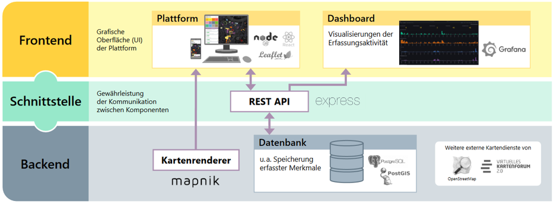

# Open Data Camp 2024 in Dresden

A warm welcome to the Open Data Camp 2024 in Dresden and to the Colouring Dresden project!

The project Colouring Dresden is organised  by the [**Leibniz-Institute of Ecological Urband Regional Development (IOER)**](https://www.ioer.de/projekte/colouring-dresden) and its partners.
It is a part of the global [**Colouring Cities Research Programme (CCRP)**](https://colouringcities.org/).

## Challenge

Colouring Dresden is a part of the challenge "Digitaler Energiezwilling für Dresden" and offers the opportunity:
- to use a dataset containing crowd-sourced collected building attributes
  - dataset on Zenodo: [**Crowd-sourced collected building attributes of the Colouring Dresden project (from 06 March 2023 to 01 October 2023)**](https://zenodo.org/records/10653065)
- to code new features within the Colouring Dresden platform (like implementing new map styles e.g. on building level, integrate and link different datasets, classify buildings into energy classes etc)
    - source code [on GitHub](https://github.com/colouring-cities/colouring-dresden), please use branch "opendatacamp2024"
    - [docs](https://github.com/colouring-cities/colouring-dresden/tree/opendatacamp2024/docs/opendatacamp2024)

Challenge description (in german) see on website of the ODC: https://www.dresden.de/de/wirtschaft/wirtschaftsstandort/projekte-kooperationen/open-data-camp-2024.php

## About Colouring Dresden

- Goal is to collect attributes for each building, like age, number of storeys, material
- collecting a more precise dataset to describe buildings and to fill current gaps in existing datasets
- make spatial modeling easier e.g. for AI prediction algorithm, for research or planning in the fields of climate adaption (flooding, heavy rain indicents, heat) or climate change (energy, reduction of CO2, ...)
- everybody can contribute, just creating an account
- Tutorial How to Map: https://colouring.dresden.ioer.info/mitmachen
- part of international research network Colouring Cities Research Programme (CCRP)

### Data categories
- All building attributes (about 40) are assigned to a thematic category (so-called "tiles")
- currently, seven are in use. Further will be enabled in future

- documentation of categories see: https://colouring.dresden.ioer.info/kacheln
- energy category is currently in progress, see reserach project "Building Trust" https://colouring.dresden.ioer.info/buildingtrust

### Further material
- Platform: https://colouring.dresden.ioer.de/
- Project page: https://colouring.dresden.ioer.info/
- Documents on Zenodo (e.g. protocolls, slides, posters): https://zenodo.org/communities/ioer_dresden/search?page=1&size=20&q=&keywords=Colouring%20Dresden
- X: https://twitter.com/colouringdd
- Instagram: https://www.instagram.com/colouringdd/

## How to contribute?
### Dataset (with crowd-sourced collected building information)

### Coding new features in platform 

#### Software architecture

#### Folder structure of GitHub Repository

#### Setting up a local dev environment

[Workflow to set up dev environment by importin image file of Ubuntu-VM / VirtualBox](setup_import_vm.md)

[Workflow to set up dev environment in a VirtualBox Ubuntu-VM from scratch using a DB Dump](setup_create_new_vm.md)

